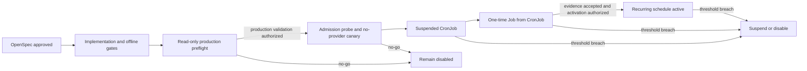

## Context

See `proposal.md` for motivation and `specs/after-market-data-collection-scheduling/spec.md` for the changed contract.

The issue's latest production observation is authoritative: TrueNAS runs k3s 1.26 and Helm revision 7 with `marketEnvironment.scheduledCollection.enabled=false`; no CronJob or collection Job exists, while the single Dashboard Deployment is healthy. The existing CronJob already calls `snapshots scheduled-refresh`, uses the Dashboard image and PVC, runs the five independent datasets, sets `concurrencyPolicy: Forbid` and `backoffLimit: 0`, and relies on SQLite dataset/date leases for concurrency with manual triggers.

The incompatibility is in deployment policy. `Chart.yaml` admits Kubernetes 1.26, the enabled Helm template always emits `spec.timeZone`, and the TrueNAS one-click defaults request an enabled but suspended CronJob. Repository documentation instead treats `spec.timeZone` as a stable Kubernetes 1.27+ boundary and requires 1.26 to keep the CronJob disabled. Helm client-side rendering cannot prove target API admission or controller trigger semantics, and container `TZ=Asia/Shanghai` affects the CLI but not when Kubernetes creates a Job.

## Goals / Non-Goals

**Goals:**

- Support a deterministic, auditable 16:30 Shanghai trigger on the existing k3s 1.26 cluster without assuming that container time or a beta API field controls scheduling.
- Make invalid combinations fail before target submission and keep the Chart's general Dashboard support at Kubernetes 1.26.
- Preserve the existing collection, storage, failure-isolation, security, and network boundaries.
- Separate implementation approval, production validation authorization, and recurring activation authorization.
- Make suspend/disable a non-destructive rollback that does not alter the Dashboard or PVC.

**Non-Goals:**

- Upgrade k3s, rely on the Kubernetes 1.26 beta timezone field by default, or change the TrueNAS control plane.
- Add an in-process scheduler, queue, worker service, exchange holiday calendar, or GitHub Actions write path.
- Change application APIs, collection datasets, provider behavior, SQLite schema, frontend behavior, NodePort exposure, or manual collection.
- Support arbitrary daylight-saving controller timezones in Kubernetes 1.26 compatibility mode.
- Perform implementation, access the production cluster, call real providers, or change production resources under this proposal workflow.

## Decisions

### 1. Use explicit native and controller-timezone strategies

Helm scheduled-collection values will select one of two strategies:

- `native`: emit `spec.timeZone: Asia/Shanghai` and interpret the cron expression in that timezone. Production policy requires Kubernetes 1.27+ plus target server-side validation. A 1.26 beta implementation is not treated as the default stable boundary.
- `controller`: omit `spec.timeZone` and interpret the cron expression in the verified kube-controller-manager timezone. This compatibility path is limited to controllers proven to use `Etc/UTC` or `Asia/Shanghai`; Shanghai 16:30 maps to `30 8 * * 1-5` for UTC and `30 16 * * 1-5` for Shanghai.

The Chart remains installable on Kubernetes 1.26 because the Dashboard itself is compatible. Template validation fails when scheduled collection is enabled with `native` below 1.27, when the strategy is unknown, or when controller mode lacks the required controller timezone and equivalent schedule. Read-only preflight first proves a single active k3s controller and captures the host timezone, k3s service environment, and the running k3s process namespace/environment/timezone files with exact commands recorded in the runbook. Conflicting evidence or multiple active controller managers makes compatibility mode a no-go.

Static evidence still cannot prove the Go controller's cached runtime timezone. Under Gate B, a temporary no-provider CronJob omitting `spec.timeZone` is scheduled for one known future controller-local minute. Its container only prints its own UTC and Shanghai clocks, mounts no PVC, disables the service-account token, and cannot invoke collection code. The external operator captures Job/Pod `creationTimestamp` and events from the API; the Pod receives no API credentials. Exactly one Job must appear at the predicted instant; the canary is then suspended and removed only after its manifest, events, Pod log, and timestamps are captured. The application CronJob remains absent or suspended until this runtime proof passes. No automatic strategy or cron fallback is allowed.

This is preferred over globally raising `Chart.yaml.kubeVersion` to 1.27, which would incorrectly reject the working Dashboard on 1.26. It is also preferred over trusting server acceptance of the 1.26 beta field: admission proves syntax support, not the repository's stability policy.

### 2. Keep business timezone separate from controller trigger timezone

`Asia/Shanghai` remains the only production business timezone. The collector container keeps `TZ=Asia/Shanghai`, and `scheduled-refresh` continues to derive the market date and settlement boundary in Shanghai time. Controller mode changes only the CronJob trigger expression; it does not change date resolution or provider validation.

The compatibility validator supports only the weekday schedule shape needed by this deployment and the two allowlisted controller zones. Production schedules use one numeric five-field trigger, `M H * * 1-5`; lists, ranges, steps, named days, multiple daily times, and times earlier than or equal to `MARKET_ENVIRONMENT_SETTLEMENT_TIME` are rejected. Native mode may choose another single post-settlement `H:M`; the TrueNAS 1.26 controller profile remains fixed to Shanghai 16:30 and its allowlisted UTC/Shanghai mapping. This avoids a general cron/timezone conversion engine and DST ambiguity. Adding another schedule shape or controller timezone requires a separate reviewed mapping and tests.

### 3. Use layered, reviewable TrueNAS release profiles

The existing complete TrueNAS values remain the production baseline. Implementation will add small, version-controlled overlays for:

- `scheduled-suspended`: controller strategy, verified-timezone configuration, `enabled=true`, `suspend=true`;
- `scheduled-active`: the same settings with `suspend=false`;
- `scheduled-off`: `enabled=false` for rollback.

The deployment entry point will render the baseline plus exactly one reviewed overlay using the actual target Kubernetes version. It will print the selected strategy and effective Shanghai trigger time, reject an unclean or inconsistent production packet, and run Helm lint/template offline. Its target admission-probe mode is separately explicit and may run server-side dry-run only under Gate B, because dry-run create/patch still requires write-class RBAC and traverses admission. It will not automatically create the canary or validation Job or unsuspend the application CronJob; those remain explicit operator actions tied to separate approvals.

Layered values avoid copying the full image/PVC/NodePort/manual-write baseline into multiple files and make activation diffs narrow. Production evidence records the ordered values files and SHA-256 hashes so a later release cannot silently change the strategy.

### 4. Treat target evidence as a release gate, not a planning assumption

After implementation is reviewed, a read-only preflight must capture the actual Helm revision and full values, k3s version, absence/current state of CronJobs and Jobs, controller timezone evidence, image tag and digest, Deployment security context, Service exposure, PVC/PV identity and capacity, snapshot path, manual-refresh setting, and rollback baseline. `docs/status.md` currently mentions revision 6, while the issue reports revision 7; implementation must correct documentation, but release decisions use the live read-only capture.

The read-only preflight may inspect API discovery/OpenAPI but does not submit server-side dry-run requests. The rendered suspended CronJob must pass target `--dry-run=server` under Gate B with the exact resource, namespace, dry-run verb, and admission audit evidence recorded. A client-side `helm template --kube-version 1.26.x` result is necessary for tests but is not production compatibility evidence.

### 5. Activate through three explicit authorization gates

- Gate A authorizes repository implementation only.
- Gate B authorizes a bounded production validation window: the exact server-side dry-run, one no-provider scheduling canary, consistent SQLite backup, suspended application CronJob release, and exactly one named provider-backed Job cloned from that CronJob after settlement.
- Gate C authorizes changing only `suspend` to false after the validation evidence is reviewed.

Before the provider-backed Job is created, the CronJob image reference must equal the Dashboard's immutable tag, the running Dashboard `imageID` must equal the containerd content digest for that tag, and the release window must freeze image import/re-tag operations. The Job must then resolve to that same image digest and PVC, retain its non-root/read-only-rootfs/no-token security posture, reach required provider endpoints, emit one structured JSON result, release all leases, leave `PRAGMA quick_check=ok`, and make exact-date results visible through provider-free reads. A `partial` exit is not automatically retried; recurring activation remains blocked until the partial result is explicitly accepted.

Gate C reuses the exact Gate B commit, chart, baseline, overlays, and hashes. Immediately before activation, a fresh Helm diff must contain no change except the application CronJob's `/spec/suspend: true -> false`; otherwise authorization is invalidated and review restarts. Because `startingDeadlineSeconds` is 1800, the packet also calculates the last and next scheduled instants in UTC and Shanghai. The default is `next-schedule` activation only after the last missed instant plus its 30-minute deadline and before the next instant with an operator safety buffer. Unsuspending inside the catch-up window is forbidden unless Gate C explicitly authorizes one immediate controller-created Job in addition to the already completed validation Job.

### 6. Preserve existing collection semantics and define launch thresholds

No collector code is planned. `Forbid` prevents overlapping Jobs from this CronJob, `backoffLimit: 0` prevents Kubernetes from replaying a partial batch, and dataset/date lease fencing remains authoritative against manual CLI/API overlap. Successful sibling tasks survive a partial result.

The pre-activation review records dataset durations, provider warnings, 403/429 responses, SQLite lock/fencing events, Pod restarts, and PVC growth. Because the current collection lease is 600 seconds and the Job deadline is 3600 seconds, any single dataset approaching the lease TTL is a no-go for recurring activation; it requires a separate lease-renewal or timeout design rather than accepting duplicate provider risk.

### 7. Roll back scheduling without rolling back data

The first response to unexpected Jobs, wrong trigger time/date, provider pressure, lock/fencing errors, restarts, or material PVC growth is the reviewed `scheduled-off` profile, or `suspend=true` when keeping the resource aids diagnosis. The operator verifies that no new Job is created and that active work reaches a terminal state.

Rollback does not uninstall Helm, delete Jobs before evidence capture, delete or replace the PVC, restore SQLite for an ordinary provider failure, change NodePort/manual collection, or use a broad historical Helm rollback with unknown values. A provider-only partial may run to the bounded deadline, but a wrong date/time, security/storage violation, lease loss, integrity threat, or runaway provider boundary requires first suspending the CronJob and then terminating only the recorded Job name/UID under the pre-authorized incident procedure. The procedure records the deletion, waits for that Pod to terminate, and verifies lease release or expiry plus `PRAGMA quick_check`; it never kills by process name or manually edits lease rows. Dashboard health and provider-free historical reads are rechecked after scheduling stops.

## Alternatives Considered

### Upgrade k3s to Kubernetes 1.27 or later

This is the cleanest long-term route to the stable native timezone field and remains the preferred future simplification. It is not selected here because a control-plane upgrade has a larger blast radius, separate TrueNAS compatibility questions, and its own rollback plan; bundling it with CronJob activation would make failure attribution poor.

### Use the Kubernetes 1.26 beta `spec.timeZone` when server dry-run accepts it

Rejected as the default production path. It may work on a particular build, but the repository already established stable 1.27+ semantics. Any exception would require explicit approval and target evidence rather than becoming an implicit fallback.

### Omit `spec.timeZone` and keep `30 16 * * 1-5`

Rejected. That runs at 16:30 in the controller's local timezone, which is not necessarily Shanghai. Container `TZ` cannot correct the trigger.

### Add an application scheduler or use GitHub Actions

Rejected. An application scheduler couples the trigger to Dashboard process health and duplicates Kubernetes lifecycle controls; GitHub Actions cannot mount the TrueNAS PVC and must not write the production SQLite database remotely.

## Risks / Trade-offs

- [Controller timezone changes after a host or k3s upgrade] -> Re-run timezone evidence and schedule-equivalence validation before every release; verify the first real trigger timestamp after activation and fail closed on drift.
- [Compatibility configuration claims the wrong timezone] -> Require independent host/service evidence, allowlist UTC/Shanghai only, and block both Helm upgrade and unsuspend when evidence is absent or inconsistent.
- [The one-time Job is partial because a provider is transiently unavailable] -> Preserve successful siblings, prohibit automatic replay, review task-level warnings and infrastructure invariants before deciding whether to rerun or activate.
- [A dataset exceeds the 600-second lease] -> Block recurring activation, preserve fencing evidence, and handle lease renewal/timeout in a separate approved change.
- [Layered values are applied in the wrong order] -> Render and hash the exact ordered packet, assert effective values, and compare Helm diff before release.
- [Existing dirty work is accidentally included] -> Start implementation from a reviewed clean revision or isolate this change without reverting unrelated user work; record the commit used for every render.
- [Manual and scheduled collection overlap] -> Retain `Forbid` plus dataset/date leases, inspect active tasks before the validation Job, and stop on busy/fenced/lease-lost anomalies.
- [Unsuspend creates a missed-schedule Job immediately] -> Calculate the 1800-second catch-up window before Gate C, default to activation outside it, and require explicit authorization for any immediate catch-up.
- [Gate C Helm upgrade changes more than suspend] -> Freeze the Gate B commit/chart/values hashes and reject any fresh diff with another resource or field change.

## Gate A Delivery Plan

### Approval and scope control

Gate A was approved on 2026-09-08 (Asia/Shanghai) in `GYT-45`. The approval evidence is member comment `01a07e3a-141c-71ac-b30b-0f06cf0c4a8b`, followed by the recorded gate decision in `01a07e3d-5a77-7972-a9cd-360c9d41dc84`. It authorizes repository implementation and offline verification only. Gate B production validation and Gate C recurring activation remain unapproved.

Backend scope covers the Helm timezone strategies and fail-closed validation, TrueNAS scheduling overlays, the deployment entry-point contract, deployment tests, and the required repository documentation. There is **no frontend scope**: the approved change does not alter Dashboard behavior, UI, browser flows, or frontend-facing API fields. No frontend issue will be assigned unless a later reviewed change adds such behavior.

The current shared worktree is not an implementation baseline: it contains unrelated tracked and untracked changes in documents and tests that this change must also touch. Planning records may be added without reverting those changes, but implementation must begin from a reviewed clean commit in an isolated branch/worktree. If that isolation cannot be established, or implementation requires a new configuration/API contract not stated in these approved artifacts, work stops and returns for architecture review.

### Milestones, ownership, and evidence

Schedule estimates are relative to promotion of the first backend backlog issue and assume one senior backend engineer. They are planning estimates, not production dates.

| Milestone | Target | Owner | Dependency | Deliverable and acceptance evidence | State |
|---|---|---|---|---|---|
| M0 - Gate A plan | D0 | Senior project manager | Gate A approval | Approval trace, active plan, serial backlog assignment, strict OpenSpec validation; no code or production action | Ready for review |
| M1 - Clean baseline and documentation contract | D1 | Senior backend engineer (`GYT-47`) | M0 accepted; reviewed clean commit/worktree | Import approved change without unrelated diffs; reconcile README, product spec, architecture, runbook, and status; fast docs-contract gate before code | Backlog |
| M2 - Repository implementation | D2-D3 | Senior backend engineer (`GYT-47`) | M1 passes | Tasks 2.1-2.5: Helm strategies/validation, three TrueNAS overlays, deployment entry point, Kustomize boundary; focused tests green | Backlog |
| M3 - Offline verification and review packet | D4 | Senior backend engineer (`GYT-48`) | `GYT-47` terminal and reviewed | Tasks 3.1-3.5: render matrix, manifest invariants, fake-provider regressions, Helm/OpenSpec/docs/diff gates, clean reviewable diff | Backlog |
| M4 - Production validation preparation | Unscheduled | Unassigned until separately authorized | M3 accepted plus explicit read-only/Gate B authorization | Tasks 4.x-5.x evidence packet and bounded production validation | Not authorized |
| M5 - Recurring activation | Unscheduled | Unassigned until Gate C | M4 evidence accepted plus explicit Gate C authorization | Tasks 6.x; fresh diff changes only `/spec/suspend` | Not authorized |

M1 and M2 are one backend implementation stage because the documentation baseline must be completed before its first code edit. M3 is a later serial backend stage and remains parked until the implementation stage is terminal and reviewed. Tasks 4.x onward are not assigned in this Gate A plan.

### Checkpoints and escalation rules

1. M0 closes only when the OpenSpec approval record, active plan, child-issue backlog, and planning validation results agree.
2. The next checkpoint is a reviewed clean commit/worktree. Only then may the M1/M2 backend issue move from `backlog` to `todo`.
3. M3 may be promoted only after M1/M2 completion evidence identifies the exact clean commit and confirms that no application API, provider, dataset, SQLite schema, frontend, or production state changed.
4. Missing canary-evidence enforcement, server-default comparison rules, backup method/space threshold, or quantitative Gate B stop thresholds must be resolved in the later release packet within the approved boundary. Any resolution that introduces a new external contract or expands production authority requires architecture re-review before implementation.
5. No production preflight, real provider call, deployment, CronJob creation, or CronJob activation is an implied follow-up. Each remains blocked by its named authorization gate.

## Migration Plan

1. Obtain Gate A approval for these OpenSpec artifacts. This does not authorize code or production changes until a new apply request is issued.
2. Create and register an active exec plan; first reconcile product, architecture, runbook, status, README, and Chart compatibility facts.
3. Implement the two Helm strategies, fail-closed validation, layered TrueNAS profiles, deployment preflight checks, and the Kubernetes 1.26/1.27 render matrix. Do not change collector application code.
4. Run offline tests with fake providers only: enabled/disabled/suspended modes, native 1.27+, controller 1.26 UTC/Shanghai, invalid combinations, shared image/PVC/security, deadlines/history, Helm lint/template, OpenSpec strict validation, docs-contract full, and `git diff --check`.
5. Submit the implementation and offline evidence for review. Obtain permission for a read-only target preflight; update the release packet with live revision/values/controller-runtime/image/PVC evidence without submitting an admission request.
6. Obtain Gate B production-validation authorization. Run the exact server-side dry-run, execute and capture one no-provider scheduling canary, and stop if the predicted controller trigger is not observed.
7. Create a non-overwriting SQLite backup, record its checksum and validate a recovery copy, then release only the suspended profile. Before provider work, bind the CronJob tag to the running Dashboard/containerd digest and freeze image changes.
8. Create exactly one uniquely named provider-backed Job from the suspended CronJob after the Shanghai settlement boundary. Capture Pod spec, image digest, PVC UID, logs, run/tasks, provider outcomes, lease release, SQLite integrity, provider-free reads, duration, restarts, and PVC delta.
9. If any date, timezone, security, storage, integrity, lease, or resource threshold fails, suspend/disable and follow the exact-Job incident procedure. A provider-only partial requires explicit disposition and is never automatically replayed.
10. Obtain Gate C recurring-activation authorization with the allowed catch-up behavior recorded. Recheck the locked hashes and require a fresh Helm diff containing only `spec.suspend`; apply the active overlay and observe the next authorized controller-created Job timestamp against 16:30 `Asia/Shanghai`.
11. Keep the off profile and validated SQLite backup available; after the observation window, update runbook/status and the exec plan's completion evidence and remaining gaps.

Rollback:

1. Apply the reviewed off profile or set `suspend=true`, then verify that no new scheduled Job is created.
2. Let an active Job terminate within its bounded deadline or stop only its exact workload under the approved incident procedure; do not delete the PVC or uninstall the release.
3. Verify Dashboard health, Service/NodePort and manual-refresh invariants, provider-free historical reads, collection audit retention, lease release, and SQLite integrity.
4. Restore data only when corruption is proven and a separate restore authorization exists; ordinary `partial`, `failed`, or provider degradation does not justify a restore.

## Open Questions

None. The live controller timezone, Helm revision, image digest, PVC identity, and validation date are release evidence to collect later; failure to prove any of them is a no-go, not a design branch.
